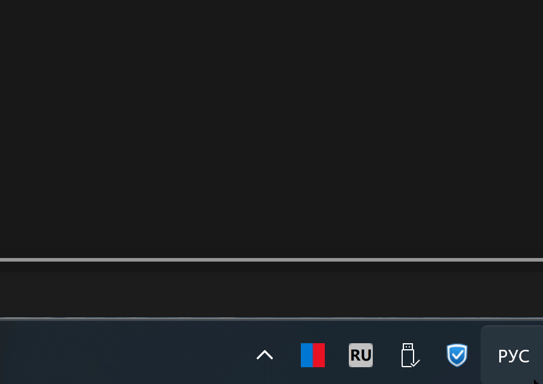
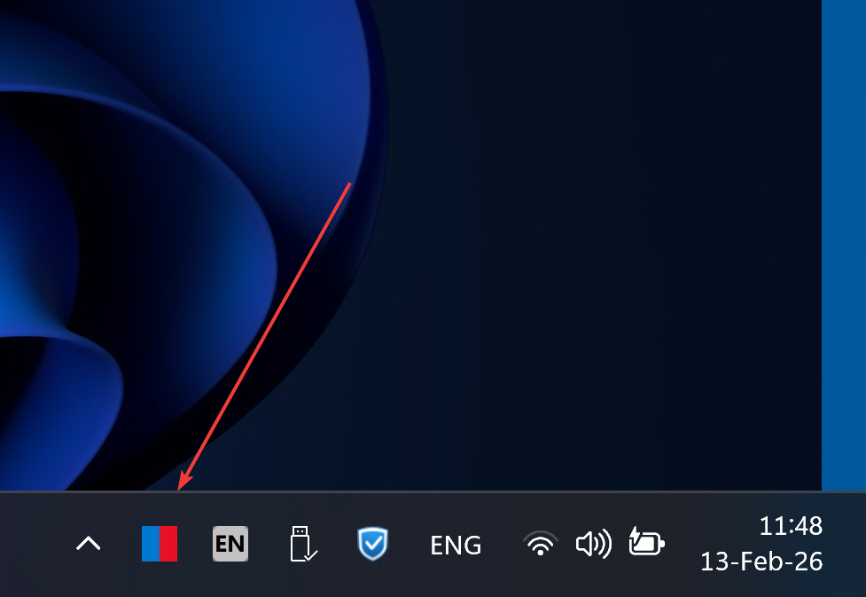
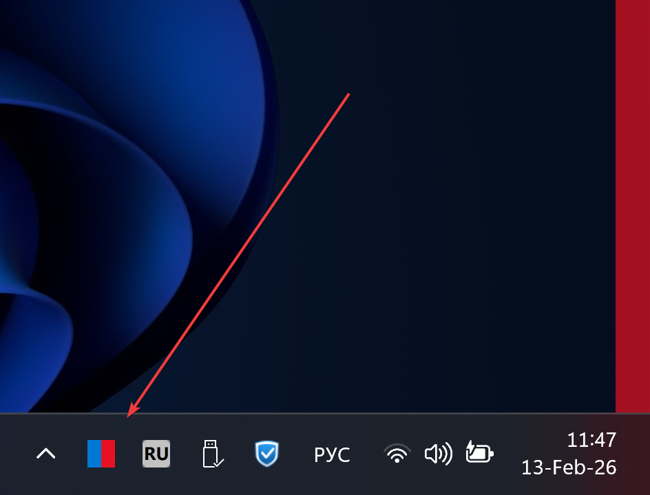
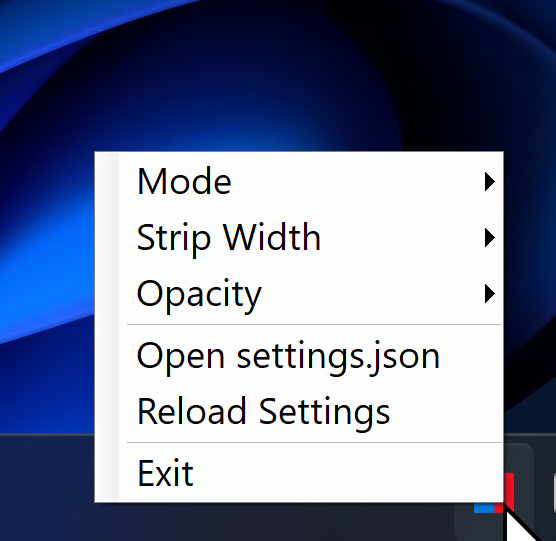

# LayoutIndicator

A lightweight Windows 11 system tray application that displays a colored vertical strip on the right edge of every monitor, indicating the currently active keyboard layout.

Switch between English and Russian (or any other layouts) and instantly see which one is active — no need to glance at the taskbar.

## Features

- **Keyboard layout detection** via Win32 API (`GetKeyboardLayout`), polled every 200ms
- **Colored strip** on the right edge of **all monitors** — blue for English, red for Russian (fully configurable)
- **Two display modes:**
  - **Always On** — strip is permanently visible, color changes instantly
  - **Flash on Change** — strip appears on layout switch, holds briefly, then fades out
- **System tray** icon with right-click context menu for quick settings access
- **Click-through overlay** — the strip never interferes with mouse clicks or keyboard input
- **Hidden from Alt+Tab** — does not clutter your window switcher
- **DPI-aware** (PerMonitorV2) — correct positioning on mixed-DPI multi-monitor setups
- **Single-instance guard** — prevents duplicate processes
- **Configurable** via `settings.json` — colors, strip width, opacity, mode, flash duration, and layout mappings

## Demo

### Layout Switch



### English Layout (Blue Strip)



### Russian Layout (Red Strip)



### System Tray Menu



## Installation

### Installer

Download `LayoutIndicator_Setup_1.0.0.exe` and run it. The installer provides:

- Install to `C:\Program Files\LayoutIndicator`
- Start Menu shortcuts
- Optional desktop shortcut
- Optional "Start with Windows" (auto-start)
- Full uninstaller (accessible from Windows Settings > Apps)
- Silent install supported: `LayoutIndicator_Setup_1.0.0.exe /S`

### Portable

Copy the contents of the `publish/` folder anywhere on your machine and run `LayoutIndicator.exe`. No installation required.

## Configuration

Settings are stored in `settings.json` next to the executable:

```json
{
  "stripWidth": 20,
  "opacity": 0.7,
  "mode": "always",
  "flashDurationSeconds": 3,
  "layouts": {
    "en-US": "#0078D4",
    "ru-RU": "#E81123"
  },
  "defaultColor": "#888888"
}
```

| Setting | Description | Default |
|---|---|---|
| `stripWidth` | Width of the strip in pixels | `20` |
| `opacity` | Strip opacity (0.0 - 1.0) | `0.7` |
| `mode` | `"always"` or `"flash"` | `"always"` |
| `flashDurationSeconds` | How long the strip is visible in flash mode | `3` |
| `layouts` | Map of culture name to hex color | EN=Blue, RU=Red |
| `defaultColor` | Color for unmapped layouts | `"#888888"` (gray) |

### Adding more layouts

Add entries to the `layouts` object using the Windows culture name:

```json
"layouts": {
  "en-US": "#0078D4",
  "ru-RU": "#E81123",
  "de-DE": "#FFB900",
  "fr-FR": "#00B294",
  "uk-UA": "#FFD700"
}
```

Changes can be applied by right-clicking the tray icon and selecting **Reload Settings**, or by restarting the application.

## System Tray Menu

Right-click the tray icon to access:

- **Mode** — switch between Always On and Flash on Change
- **Strip Width** — choose from 5, 10, 15, 20, 30, or 50 px
- **Opacity** — choose from 30%, 50%, 70%, 85%, or 100%
- **Open settings.json** — opens the config file in your default editor
- **Reload Settings** — applies changes from settings.json without restarting
- **Exit** — closes the application

## Building from Source

### Requirements

- [.NET 8 SDK](https://dotnet.microsoft.com/download/dotnet/8.0) (or later)
- Windows 10/11 (WPF target)

### Build

```powershell
cd LayoutIndicator
dotnet build -c Release
```

### Publish (self-contained single file)

```powershell
dotnet publish -c Release -r win-x64 --self-contained -p:PublishSingleFile=true -o publish
```

### Build Installer

Requires [NSIS 3.x](https://nsis.sourceforge.io/):

```powershell
makensis installer.nsi
```

## Project Structure

```
LayoutIndicator/
├── LayoutIndicator.sln
├── installer.nsi                          # NSIS installer script
├── LICENSE.txt                            # MIT License
├── README.md
└── LayoutIndicator/
    ├── LayoutIndicator.csproj             # .NET 8 WPF + WinForms
    ├── app.manifest                       # Windows 10/11 compatibility
    ├── settings.json                      # Default configuration
    ├── App.xaml / App.xaml.cs             # Entry point, tray icon, single-instance
    ├── OverlayWindow.xaml / .xaml.cs      # Transparent click-through strip
    ├── Models/
    │   └── AppSettings.cs                 # Settings model
    └── Services/
        ├── KeyboardLayoutMonitor.cs       # Win32 keyboard layout detection
        ├── MonitorService.cs              # Multi-monitor overlay management
        └── SettingsService.cs             # JSON settings load/save
```

## How It Works

1. `KeyboardLayoutMonitor` polls the foreground window's keyboard layout every 200ms using `GetForegroundWindow` + `GetKeyboardLayout` Win32 APIs
2. When a layout change is detected, `MonitorService` looks up the corresponding color from `settings.json`
3. Each `OverlayWindow` (one per monitor) updates its strip color — either immediately (always mode) or with a fade animation (flash mode)
4. The overlay windows use `WS_EX_TRANSPARENT | WS_EX_TOOLWINDOW | WS_EX_NOACTIVATE` extended styles to be fully click-through and invisible to Alt+Tab

## License

[MIT](LICENSE.txt)
